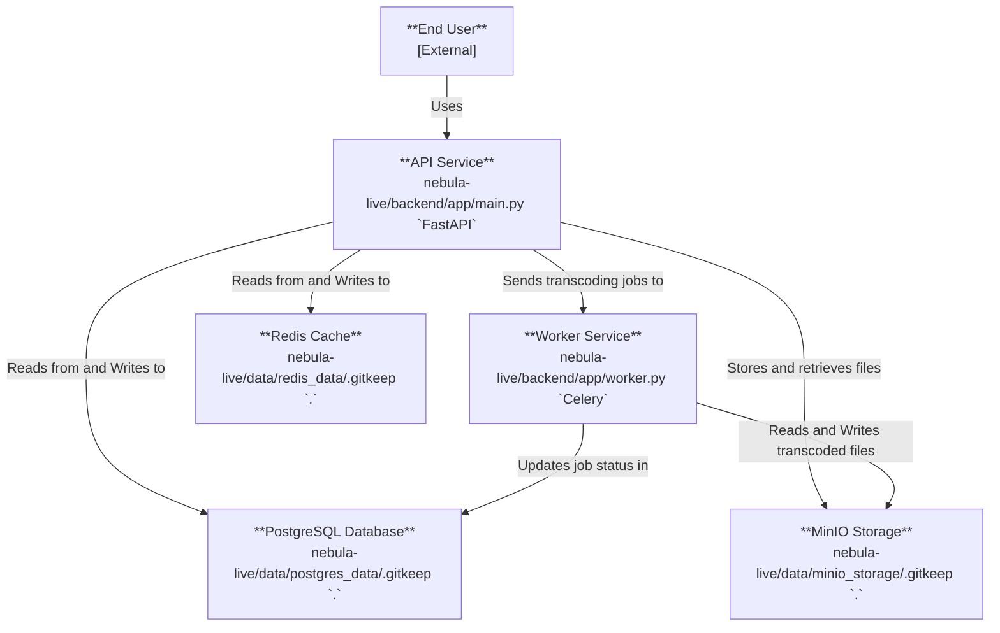

# Unnamed CodeViz Diagram

```mermaid
graph TD

    base.cv::api_service["**API Service**<br>nebula-live/backend/app/main.py `FastAPI`"]
    base.cv::worker_service["**Worker Service**<br>nebula-live/backend/app/worker.py `Celery`"]
    base.cv::postgresql["**PostgreSQL Database**<br>nebula-live/data/postgres_data/.gitkeep `.`"]
    base.cv::redis["**Redis Cache**<br>nebula-live/data/redis_data/.gitkeep `.`"]
    base.cv::minio["**MinIO Storage**<br>nebula-live/data/minio_storage/.gitkeep `.`"]
    base.cv::user["**End User**<br>[External]"]
    %% Edges at this level (grouped by source)
    base.cv::user["**End User**<br>[External]"] -->|"Uses"| base.cv::api_service["**API Service**<br>nebula-live/backend/app/main.py `FastAPI`"]
    base.cv::api_service["**API Service**<br>nebula-live/backend/app/main.py `FastAPI`"] -->|"Reads from and Writes to"| base.cv::postgresql["**PostgreSQL Database**<br>nebula-live/data/postgres_data/.gitkeep `.`"]
    base.cv::api_service["**API Service**<br>nebula-live/backend/app/main.py `FastAPI`"] -->|"Reads from and Writes to"| base.cv::redis["**Redis Cache**<br>nebula-live/data/redis_data/.gitkeep `.`"]
    base.cv::api_service["**API Service**<br>nebula-live/backend/app/main.py `FastAPI`"] -->|"Stores and retrieves files"| base.cv::minio["**MinIO Storage**<br>nebula-live/data/minio_storage/.gitkeep `.`"]
    base.cv::api_service["**API Service**<br>nebula-live/backend/app/main.py `FastAPI`"] -->|"Sends transcoding jobs to"| base.cv::worker_service["**Worker Service**<br>nebula-live/backend/app/worker.py `Celery`"]
    base.cv::worker_service["**Worker Service**<br>nebula-live/backend/app/worker.py `Celery`"] -->|"Reads and Writes transcoded files"| base.cv::minio["**MinIO Storage**<br>nebula-live/data/minio_storage/.gitkeep `.`"]
    base.cv::worker_service["**Worker Service**<br>nebula-live/backend/app/worker.py `Celery`"] -->|"Updates job status in"| base.cv::postgresql["**PostgreSQL Database**<br>nebula-live/data/postgres_data/.gitkeep `.`"]

```
---
*Generated by [CodeViz.ai](https://codeviz.ai) on 22/12/2025, 13:00:47*
