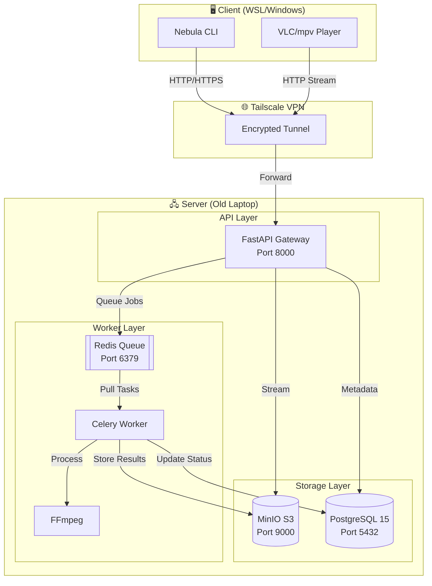

# 🌌 Nebula: Distributed Private Cloud & Streaming Engine

<div align="center">

**Your Personal Netflix + Dropbox on an Old Laptop**

[]()
[]()
[]()

</div>

---

## 📋 Table of Contents

- [Executive Summary](#-executive-summary)
- [Features](#-features-implemented)
- [Quick Start](#-quick-start)
- [Architecture](#-architecture)
- [Project Structure](#-project-structure)
- [CLI Commands](#-cli-commands)
- [Common Issues & Solutions](#-common-issues--solutions)
- [Development](#-development)

---

## 🎯 Executive Summary

Nebula transforms a single "waste" laptop into a **private cloud platform** capable of storing, streaming, and processing media files. It's your personal **Netflix + Dropbox**, running entirely on hardware you control.

### Core Capabilities

- ☁️ **Object Storage** - S3-compatible storage layer (MinIO) for unlimited file types
- 🎬 **Video Streaming** - HTTP byte-range streaming with seeking support (like Netflix)
- 🔒 **Zero-Trust Security** - Tailscale VPN mesh network (no public ports exposed)
- ⚡ **Async Processing** - Background transcoding pipeline (Celery + Redis + FFmpeg)
- 🚀 **CLI Tools** - Beautiful terminal interface for all operations

---

## ✨ Features Implemented

### ✅ Phase 1: Connectivity ✓
- **`nebula ping`** - Server health check
- **`nebula status`** - Detailed system health dashboard

### ✅ Phase 2: Storage ✓
- **`nebula upload <file>`** - Upload files of any size (curl-based, WSL-compatible)
- **`nebula list`** - List all files with metadata in beautiful tables
- **`nebula download <id>`** - Download files with progress bars
- **Direct MinIO integration** - Streaming uploads/downloads

### ✅ Phase 3: Media Streaming ✓
- **`nebula play <id>`** - Stream videos directly to VLC/mpv
- **Byte-Range Support** - HTTP 206 Partial Content for seeking
- **Instant Seeking** - Jump to any part of a video without full download

### 🚧 Phase 4: Transcoding (In Progress)
- **Celery Worker** - Background job queue configured
- **Redis Queue** - Job distribution ready
- **FFmpeg Integration** - Planned for multi-quality video output

---

## 🚀 Quick Start

### Server Setup (Old Laptop)

```bash
# 1. Clone repository
git clone <repo-url> ~/nebula
cd ~/nebula/server

# 2. Create .env file
cat > .env << EOF
SECRET_KEY=your-secret-key-here
DATABASE_URL=postgresql://nebula:nebula_secure@db:5432/nebula_meta
S3_ENDPOINT=http://s3:9000
S3_ACCESS_KEY=admin
S3_SECRET_KEY=nebula_secure
S3_BUCKET=nebula-uploads
REDIS_URL=redis://queue:6379/0
EOF

# 3. Start all services
docker-compose up -d

# 4. Initialize database
docker exec -it nebula-api bash
alembic upgrade head
exit
```

### Client Setup (New Laptop)

```bash
# 1. Navigate to CLI directory
cd nebula/client/cli

# 2. Create virtual environment
python3 -m venv ../.venv
source ../.venv/bin/activate

# 3. Install CLI
pip install -e .

# 4. Configure server URL
echo "NEBULA_SERVER_URL=http://YOUR_TAILSCALE_IP:8000" > .env.client

# 5. Test connection
nebula ping
```

---

## 🏗️ Architecture

### High-Level Architecture



### Data Flow: Upload

```
1. User: nebula upload movie.mp4
   ↓
2. CLI: HTTP POST (curl --no-buffer)
   ↓
3. FastAPI: Receives multipart/form-data
   ↓
4. File Service: Streams to MinIO
   ↓
5. MinIO: Stores file in S3 bucket
   ↓
6. PostgreSQL: Saves metadata (filename, size, path, etc.)
   ↓
7. Response: Returns file ID to user
```

### Data Flow: Streaming

```
1. User: nebula play 67
   ↓
2. CLI: Launches VLC with stream URL
   ↓
3. VLC: HTTP GET /api/files/67/stream
   ↓
4. FastAPI: Parses Range header (e.g., "bytes=50000000-60000000")
   ↓
5. MinIO: Reads only requested bytes
   ↓
6. FastAPI: Returns HTTP 206 Partial Content
   ↓
7. VLC: Plays video chunk, can seek instantly
```

### Service Communication

| Service | Port | Purpose | Protocol |
|---------|------|---------|----------|
| **nebula-api** | 8000 | HTTP API Gateway | FastAPI/HTTP |
| **nebula-s3** | 9000 | Object Storage | S3 API |
| **nebula-db** | 5432 | Relational Database | PostgreSQL |
| **nebula-queue** | 6379 | Job Queue | Redis Protocol |
| **nebula-worker** | - | Background Tasks | Internal (Celery) |

---

## 📁 Project Structure

```
nebula/
├── 📂 client/
│   └── 📂 cli/                          # Python CLI Client
│       ├── 📂 src/
│       │   ├── main.py                  # CLI entry point (Typer)
│       │   └── 📂 commands/
│       │       ├── upload.py            # ✅ Upload with curl
│       │       ├── download.py          # ✅ Download with progress
│       │       ├── list.py              # ✅ List files (Rich tables)
│       │       ├── play.py              # ✅ Stream to VLC
│       │       └── status.py            # ✅ System health
│       ├── pyproject.toml               # Package config
│       └── .env.client                  # Client config (gitignored)
│
├── 📂 server/
│   └── 📂 backend/
│       ├── 📂 app/
│       │   ├── main.py                  # FastAPI app & routers
│       │   ├── 📂 api/                  # HTTP Endpoints
│       │   │   ├── upload.py            # POST /api/upload
│       │   │   ├── files.py             # GET /api/files
│       │   │   ├── stream.py            # GET /api/files/{id}/stream
│       │   │   └── ping.py              # GET /health, /ping
│       │   ├── 📂 core/                 # Core Services
│       │   │   ├── config.py            # Environment config
│       │   │   ├── database.py          # SQLAlchemy setup
│       │   │   ├── s3_client.py         # MinIO wrapper
│       │   │   └── security.py          # JWT (future)
│       │   ├── 📂 models/               # Database Models
│       │   │   ├── file.py              # File metadata model
│       │   │   ├── user.py              # User model (future)
│       │   │   └── job.py               # Transcode job model
│       │   ├── 📂 services/             # Business Logic
│       │   │   ├── file_service.py      # Upload/download logic
│       │   │   ├── metadata_service.py  # File metadata
│       │   │   └── transcode_service.py # FFmpeg (future)
│       │   └── worker.py                # Celery app
│       ├── Dockerfile                   # Container definition
│       ├── requirements.txt             # Python dependencies
│       └── alembic.ini                  # Database migrations
│   ├── docker-compose.yml               # 5-service orchestration
│   ├── .env                             # Server secrets (gitignored)
│   └── 📂 data/                         # Persistent volumes
│       ├── minio_storage/               # Actual files
│       ├── postgres_data/               # Database files
│       └── redis_data/                  # Queue persistence
│
└── 📂 nebula.git/                       # GitOps bare repo
    └── 📂 hooks/
        └── post-receive                 # Auto-deploy script
```

---

## 💻 CLI Commands

### Basic Commands

```bash
# Test connectivity
nebula ping

# Upload a file
nebula upload "/path/to/file.mp4" --description "My video"

# List all files
nebula list

# List with pagination
nebula list --limit 20 --skip 0

# Download a file
nebula download 67

# Download to specific location
nebula download 67 --output ~/Downloads/myfile.mp4

# Stream video to player
nebula play 67

# System health check
nebula status
```

### Command Reference

| Command | Description | Options |
|---------|-------------|---------|
| `ping` | Quick connectivity test | None |
| `upload <file>` | Upload file to cloud | `--description` |
| `list` | List all files | `--limit`, `--skip` |
| `download <id>` | Download file by ID | `--output`, `-o` |
| `play <id>` | Stream video to VLC/mpv | `--player` |
| `status` | System health dashboard | `--show-local`, `--show-server` |

---

## ⚠️ Common Issues & Solutions

### 🐛 Issue: Uploads Hang Forever from WSL

**Symptoms:**
- `nebula upload` connects but never completes
- Health check (`nebula ping`) works fine
- `curl` also hangs when uploading files

**Root Cause:**
WSL has Tailscale installed, which conflicts with Windows Tailscale, causing packet loss.

**Solution:**
```bash
# Disable Tailscale in WSL (use Windows Tailscale instead)
sudo tailscale down

# Make it permanent - add to ~/.bashrc
echo 'sudo tailscale down 2>/dev/null || true' >> ~/.bashrc

# Or uninstall Tailscale from WSL entirely
sudo apt remove tailscale
```

**Why This Works:**
- Windows Tailscale handles routing correctly
- WSL → Windows → Tailscale → Server path works
- WSL Tailscale → Tailscale creates a black hole for large packets

---

### 🐛 Issue: "NEBULA_SERVER_URL environment variable not set"

**Symptoms:**
```
❌ Error: NEBULA_SERVER_URL environment variable not set
```

**Solution:**
```bash
# Create .env.client in client/cli directory
cd client/cli
echo "NEBULA_SERVER_URL=http://YOUR_TAILSCALE_IP:8000" > .env.client
```

**Find Your Tailscale IP:**
```bash
# On server laptop
tailscale status
# Look for the Linux machine IP (e.g., 100.83.147.22)
```

---

### 🐛 Issue: Video Streaming Works But Seeking Doesn't

**Symptoms:**
- Videos play from the start
- Can't skip ahead or seek
- Have to watch entire video

**Root Cause:**
Server not properly handling HTTP Range requests (HTTP 206).

**Solution:**
Ensure you're using the latest `stream.py` with byte-range support:
```bash
# On server, check the endpoint is registered
docker exec -it nebula-api curl http://localhost:8000/api/files/67/stream -H "Range: bytes=0-1000" -I

# Should return: HTTP/1.1 206 Partial Content
```

---

### 🐛 Issue: "File not found" After Upload

**Symptoms:**
- Upload appears successful
- File ID returned
- But file doesn't appear in `nebula list`

**Solution:**
```bash
# Check server logs
docker logs nebula-api

# Check MinIO directly
docker exec -it nebula-s3 mc ls nebula-uploads/

# Verify database has record
docker exec -it nebula-db psql -U nebula -d nebula_meta -c "SELECT id, filename FROM files ORDER BY id DESC LIMIT 5;"
```

---

### 🐛 Issue: Cannot Connect from PowerShell (Windows)

**Symptoms:**
- Works in WSL but not PowerShell
- "Command not found: nebula"

**Solution:**
Create a PowerShell function or batch file:

**Option 1: PowerShell Function**
```powershell
# Add to $PROFILE
function nebula {
    wsl -e bash -c "cd /home/abhinav/dev/nebula/client/cli && source /home/abhinav/dev/nebula/client/.venv/bin/activate && nebula $args"
}
```

**Option 2: Batch File**
```batch
# Create C:\Users\abhin\nebula.bat
@echo off
wsl -e bash -c "cd /home/abhinav/dev/nebula/client/cli && source /home/abhinav/dev/nebula/client/.venv/bin/activate && nebula %*"
```

---

### 🐛 Issue: Celery Worker Not Processing Jobs

**Symptoms:**
- Jobs queued but never complete
- Worker container running but idle

**Solution:**
```bash
# Check worker logs
docker logs nebula-worker

# Verify Redis connectivity
docker exec -it nebula-worker python -c "import redis; r=redis.from_url('redis://queue:6379/0'); print(r.ping())"

# Restart worker
docker-compose restart worker
```

---

## 🔧 Development

### Running Tests

```bash
# Server tests (TODO: Add test suite)
cd server/backend
pytest

# CLI tests (TODO: Add test suite)
cd client/cli
pytest
```

### Database Migrations

```bash
# Create new migration
docker exec -it nebula-api alembic revision --autogenerate -m "Description"

# Apply migrations
docker exec -it nebula-api alembic upgrade head

# Rollback
docker exec -it nebula-api alembic downgrade -1
```

### Adding New Features

1. **New API Endpoint:**
   - Add route in `server/backend/app/api/`
   - Register in `server/backend/app/main.py`

2. **New CLI Command:**
   - Create file in `client/cli/src/commands/`
   - Register in `client/cli/src/main.py`

3. **Database Changes:**
   - Update model in `server/backend/app/models/`
   - Generate migration with Alembic

---

## 📊 Implementation Status

### ✅ Completed Features

| Feature | Status | Notes |
|---------|--------|-------|
| File Upload | ✅ | curl-based, WSL-compatible |
| File Download | ✅ | Progress bars, resume support planned |
| File Listing | ✅ | Rich tables, pagination |
| Video Streaming | ✅ | Byte-range support, seeking |
| Health Checks | ✅ | System status dashboard |
| WSL Integration | ✅ | Temp file copy workaround |

### 🚧 In Progress

| Feature | Status | Notes |
|---------|--------|-------|
| Video Transcoding | 🚧 | Celery worker configured, FFmpeg integration needed |
| Multi-Quality Output | 🚧 | Requires transcoding first |
| Authentication | 🚧 | JWT scaffold ready |
| File Deletion | 🚧 | API endpoint needed |

### 📋 Planned

| Feature | Priority | Description |
|---------|----------|-------------|
| Resume Downloads | Medium | Resume interrupted downloads |
| Search | Medium | Search files by name/metadata |
| Thumbnails | Low | Generate video thumbnails |
| Web UI | Low | Browser-based interface |

---

## 📝 License

MIT License - See LICENSE file for details

---

## 🙏 Acknowledgments

Built with:
- [FastAPI](https://fastapi.tiangolo.com/) - Modern Python web framework
- [MinIO](https://min.io/) - S3-compatible storage
- [Tailscale](https://tailscale.com/) - Zero-config VPN
- [Typer](https://typer.tiangolo.com/) - CLI framework
- [Rich](https://github.com/Textualize/rich) - Beautiful terminal output

---

<div align="center">

**Made with ❤️ for personal cloud freedom**

[Report Bug](https://github.com/zeus-10/nebula/issues) · [Request Feature](https://github.com/zeus-10/nebula/issues)

</div>
