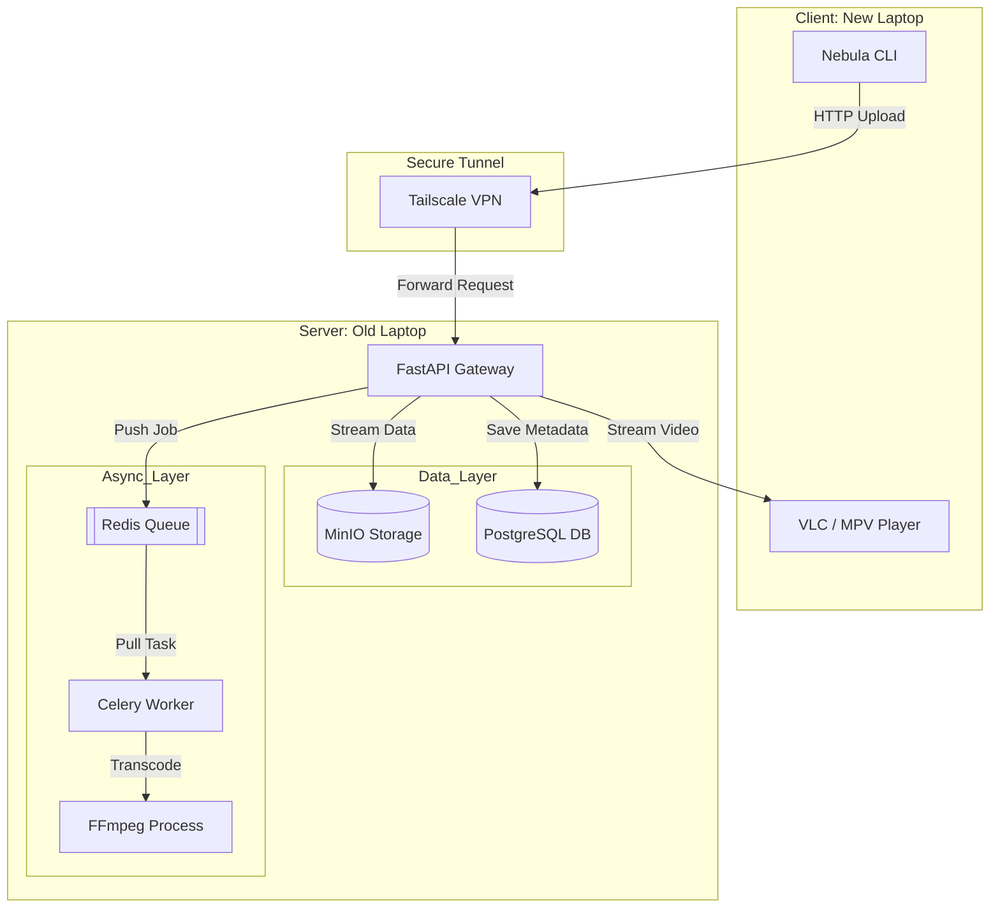

# Nebula: Distributed Private Cloud & Streaming Engine

**Version:** 1.0.0-alpha  
**Status:** 🏗️ In Development  
**Architecture:** Microservices (Client-Server)  
**Infrastructure:** Self-Hosted Bare Metal

## 1. Executive Summary

Nebula is a private, distributed cloud platform designed to run on a single "waste" laptop (Intel i5 11th Gen). It decouples storage, compute, and state into isolated microservices, creating a robust "Personal AWS."

### Core Capabilities

- **Data Sovereignty:** A private S3-compatible object storage layer (MinIO) that abstracts the physical filesystem.
- **Adaptive Streaming:** A Netflix-style video pipeline supporting HTTP Byte-Range requests (seeking/scrubbing).
- **Zero-Trust Security:** A private mesh VPN (Tailscale) that exposes no public ports.
- **Resilient Processing:** An asynchronous worker queue for background media transcoding (FFmpeg).
- **Persistent Auth:** Dual-token JWT system (Access + Refresh) to prevent "login fatigue."

## 2. System Architecture

The system uses a Microservices Architecture. Services communicate over an internal Docker network, while the client connects via a secure Tailscale tunnel.

### A. High-Level Architecture Diagram



### B. Service Roles

| Service | Container Name | Role | Tech Stack |
|---------|---------------|------|------------|
| Gateway | nebula-api | Entry point. Handles Auth, Uploads & Streaming. | FastAPI (Python) |
| Storage | nebula-s3 | Stores raw binary files (S3 Protocol). | MinIO |
| State | nebula-db | Stores User data, File metadata, and Job status. | PostgreSQL 15 |
| Queue | nebula-queue | Holds background jobs (transcoding tasks). | Redis 7 |
| Worker | nebula-worker | Executes CPU-heavy tasks (FFmpeg) asynchronously. | Celery |

## 3. Directory Structure

This project uses a GitOps workflow. You push code to a bare repository on the server, which automatically builds the live application via a post-receive hook.

```
/home/nebula_user/
├── nebula.git/                  # [Bare Repo] Receives 'git push'
│   └── hooks/
│       └── post-receive         # Script: Checkout code -> Rebuild Docker
│
├── server/                       # [Runtime] The Active Application
│   ├── docker-compose.yml       # Infrastructure Definition
│   ├── .env                     # Secrets (Not in Git)
│   ├── backend/                 # Source Code
│   │   ├── Dockerfile
│   │   ├── app/                 # Python Package
│   │   │   ├── main.py          # API Gateway Entrypoint
│   │   │   ├── core/            # Config & Security
│   │   │   ├── api/             # HTTP Routes (Upload/Stream)
│   │   │   └── services/        # Business Logic (S3/DB interactions)
│   │   └── worker.py            # Celery Entrypoint
│   └── data/                    # [Persistence Layer] (Mapped to SSD)
│       ├── minio_storage/       # <--- Actual Movie Files
│       ├── postgres_data/       # <--- DB Tables
│       └── redis_data/          # <--- Queue Persistence
```

## 4. Master Infrastructure (docker-compose.yml)

Use this file to spin up the entire stack on the server.

```yaml
version: '3.8'

services:
  # --- Storage Layer ---
  s3:
    image: minio/minio:RELEASE.2023-09-30T07-02-29Z
    container_name: nebula-s3
    restart: always
    command: server /data --console-address ":9001"
    ports:
      - "9000:9000"  # API Port
      - "9001:9001"  # Console Port
    environment:
      - MINIO_ROOT_USER=admin
      - MINIO_ROOT_PASSWORD=nebula_secure
    volumes:
      - ./data/minio_storage:/data

  # --- State Layer ---
  db:
    image: postgres:15-alpine
    container_name: nebula-db
    restart: always
    environment:
      - POSTGRES_USER=nebula
      - POSTGRES_PASSWORD=nebula_secure
      - POSTGRES_DB=nebula_meta
    volumes:
      - ./data/postgres_data:/var/lib/postgresql/data

  # --- Queue Layer ---
  queue:
    image: redis:7-alpine
    container_name: nebula-queue
    restart: always
    ports:
      - "6379:6379"

  # --- API Gateway ---
  api:
    build: 
      context: ./backend
      dockerfile: Dockerfile
    container_name: nebula-api
    restart: always
    ports:
      - "8000:8000"
    volumes:
      - ./backend:/app
      - /sys/class/power_supply:/host_power:ro  # Battery Monitoring
    depends_on:
      - db
      - queue
      - s3
    environment:
      - DATABASE_URL=postgresql://nebula:nebula_secure@db:5432/nebula_meta
      - REDIS_URL=redis://queue:6379/0
      - S3_ENDPOINT=http://s3:9000
      - S3_ACCESS_KEY=admin
      - S3_SECRET_KEY=nebula_secure
      - S3_BUCKET=nebula-uploads
      - ACCESS_TOKEN_EXPIRE_MINUTES=15
      - REFRESH_TOKEN_EXPIRE_DAYS=30

  # --- Async Worker ---
  worker:
    build: 
      context: ./backend
      dockerfile: Dockerfile
    container_name: nebula-worker
    restart: always
    command: celery -A app.worker.celery_app worker --loglevel=info
    devices:
       - /dev/dri:/dev/dri # Hardware Transcoding (Intel QuickSync)
    depends_on:
      - db
      - queue
      - s3
    environment:
      # (Same Env Vars as API)
      - DATABASE_URL=postgresql://nebula:nebula_secure@db:5432/nebula_meta
      - REDIS_URL=redis://queue:6379/0
      - S3_ENDPOINT=http://s3:9000
      - S3_ACCESS_KEY=admin
      - S3_SECRET_KEY=nebula_secure
      - S3_BUCKET=nebula-uploads
```

## 5. Database Setup & Migrations

### Environment Variables

Create a `.env` file in the `server/` directory with your configuration:

```env
# Security
SECRET_KEY=your-secret-key-here

# Database
DATABASE_URL=postgresql://nebula:nebula_secure@db:5432/nebula_meta

# MinIO/S3
S3_ENDPOINT=http://s3:9000
S3_ACCESS_KEY=admin
S3_SECRET_KEY=nebula_secure
S3_BUCKET=nebula-uploads

# Redis
REDIS_URL=redis://queue:6379/0
```

### Database Migrations (Alembic)

After starting the containers, set up the database schema:

```bash
# Enter the API container
docker exec -it nebula-api bash

# Initialize Alembic (if not done)
alembic init alembic

# Configure alembic.ini with your database URL
# (Already done in our setup)

# Generate initial migration
alembic revision --autogenerate -m "Initial schema"

# Apply migration to create tables
alembic upgrade head

# Check current migration status
alembic current
```

**What this creates:**
- `files` table for storing upload metadata
- Migration tracking in `alembic_version` table
- Version-controlled schema changes

---

## 7. Implementation Phases

### 🟦 Phase 1: Connectivity (The Handshake)

**Goal:** Verify secure communication between Client and Server.

**Deliverable:** A `nebula ping` command returning "Pong" from the remote server.

### 🟨 Phase 2: Storage (The Vault)

**Goal:** Enable file ingestion and retrieval.

**Deliverable:**
- `nebula upload <file>`: Streams data to MinIO.
- `nebula ls`: Lists files stored in the cloud.

### 🟧 Phase 3: Media (The Cinema)

**Goal:** Enable instant video playback.

**Tech:** HTTP Byte-Range Requests (Status 206).

**Deliverable:** `nebula play <movie>` spawns a local VLC window streaming from the server.

### 🟥 Phase 4: Compute (The Factory)

**Goal:** Automated video optimization.

**Tech:** Celery + Redis + FFmpeg.

**Deliverable:** Uploading a raw `.mkv` triggers a background job that converts it to a web-optimized `.mp4`.
