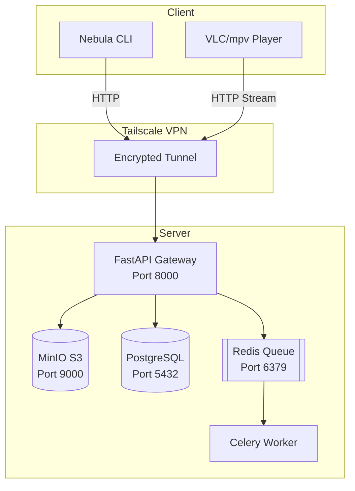

# 🌌 Nebula: Distributed Private Cloud & Streaming Engine

<div align="center">

**Your Personal Netflix + Dropbox on an Old Laptop**

[]()
[]()
[]()

</div>

---

## Table of Contents

- [Overview](#overview)
- [Features](#features)
- [Quick Start](#quick-start)
- [Architecture](#architecture)
- [CLI Commands](#cli-commands)
- [Troubleshooting](#troubleshooting)

---

## Overview

Nebula transforms a single "waste" laptop into a private cloud platform for storing and streaming media files. It provides S3-compatible object storage, HTTP byte-range video streaming, and secure access via Tailscale VPN.

### Core Capabilities

- **Object Storage** - S3-compatible storage (MinIO) for unlimited file types
- **Video Streaming** - HTTP byte-range streaming with seeking support
- **Zero-Trust Security** - Tailscale VPN mesh network (no public ports)
- **CLI Tools** - Terminal interface for all operations

---

## Features

- **`nebula ping`** – Server health check
- **`nebula upload <file>`** – Upload files of any size (WSL-compatible)
- **`nebula list`** – List all files with metadata
- **`nebula download <id>`** – Download files with progress bars
- **`nebula play <id>`** – Stream videos directly to VLC/mpv with seeking support
- **`nebula play <id> --quality 480`** – Stream transcoded variants at specific quality
- **`nebula transcode <id>`** – Create 480p/720p/1080p versions in the background
- **`nebula status`** – System health dashboard
- **`nebula logs` / `nebula logs api`** – View server/container logs remotely
- **`nebula restart`** – Restart Nebula services from the CLI
- **`nebula containers`** – Show Docker container status from the CLI

---

## Quick Start

### Server Setup

```bash
git clone <repo-url> ~/nebula
cd ~/nebula/server

# Create .env file
cat > .env << EOF
SECRET_KEY=your-secret-key-here
DATABASE_URL=postgresql://nebula:nebula_secure@db:5432/nebula_meta
S3_ENDPOINT=http://s3:9000
S3_ACCESS_KEY=admin
S3_SECRET_KEY=nebula_secure
S3_BUCKET=nebula-uploads
REDIS_URL=redis://queue:6379/0
EOF

# Start services
docker-compose up -d

# Initialize database
docker exec -it nebula-api alembic upgrade head
```

### Client Setup

```bash
cd nebula/client/cli
python3 -m venv ../.venv
source ../.venv/bin/activate
pip install -e .
echo "NEBULA_SERVER_URL=http://YOUR_TAILSCALE_IP:8000" > .env.client
nebula ping
```

---

## Architecture



### Service Communication

| Service | Port | Purpose |
|---------|------|---------|
| nebula-api | 8000 | HTTP API Gateway |
| nebula-s3 | 9000 | Object Storage |
| nebula-db | 5432 | PostgreSQL Database |
| nebula-queue | 6379 | Redis Queue |
| nebula-worker | - | Celery Worker |

---

## CLI Commands

```bash
# Test connectivity
nebula ping

# Upload a file
nebula upload "/path/to/file.mp4" --description "My video"

# List files
nebula list
nebula list --limit 20 --skip 0

# Download file
nebula download 67
nebula download 67 --output ~/Downloads/myfile.mp4

# Stream video (original)
nebula play 67

# Transcoding (multi-quality)
nebula transcode 67 -q 480,720,1080
nebula transcode-status 67 --watch

# Stream specific quality (after transcoding finishes)
nebula play 67 --quality 480

# Logs and containers
nebula logs api -n 200
nebula containers

# Restart services (use carefully)
nebula restart worker --force
nebula restart --force
nebula status
```

| Command | Description | Options |
|---------|-------------|---------|
| `ping` | Connectivity test | - |
| `upload <file>` | Upload file | `--description` |
| `list` | List files | `--limit`, `--skip` |
| `download <id>` | Download file | `--output`, `-o` |
| `play <id>` | Stream video | `--player`, `--quality` |
| `transcode <id>` | Create transcoded variants | `--qualities` (`-q`) |
| `transcode-status <id>` | Show transcoding status | `--watch` |
| `transcode-jobs` | List transcoding jobs | `--status`, `--limit` |
| `transcode-cancel <job_id>` | Cancel a transcoding job | - |
| `status` | System health | `--show-local`, `--show-server` |
| `logs [service]` | View logs for all or one service | `--lines` (`-n`) |
| `restart [service]` | Restart one or all services | `--force` (`-f`) |
| `containers` | Show container status | - |

---

## Troubleshooting

### Uploads Hang Forever from WSL

**Cause:** WSL Tailscale conflicts with Windows Tailscale.

**Solution:**
```bash
sudo tailscale down
echo 'sudo tailscale down 2>/dev/null || true' >> ~/.bashrc
```

### "NEBULA_SERVER_URL environment variable not set"

**Solution:**
```bash
cd client/cli
echo "NEBULA_SERVER_URL=http://YOUR_TAILSCALE_IP:8000" > .env.client
```

### Video Seeking Doesn't Work

**Solution:** Verify byte-range support:
```bash
docker exec -it nebula-api curl http://localhost:8000/api/files/67/stream \
  -H "Range: bytes=0-1000" -I
# Should return: HTTP/1.1 206 Partial Content
```

### Cannot Connect from PowerShell

**Solution:** Add to PowerShell `$PROFILE`:
```powershell
function nebula {
    wsl -e bash -c "cd /home/abhinav/dev/nebula/client/cli && source /home/abhinav/dev/nebula/client/.venv/bin/activate && nebula $args"
}
```

---

## License

MIT License

---

## Acknowledgments

Built with FastAPI, MinIO, Tailscale, Typer, and Rich.

[Report Bug](https://github.com/zeus-10/nebula/issues) · [Request Feature](https://github.com/zeus-10/nebula/issues)
