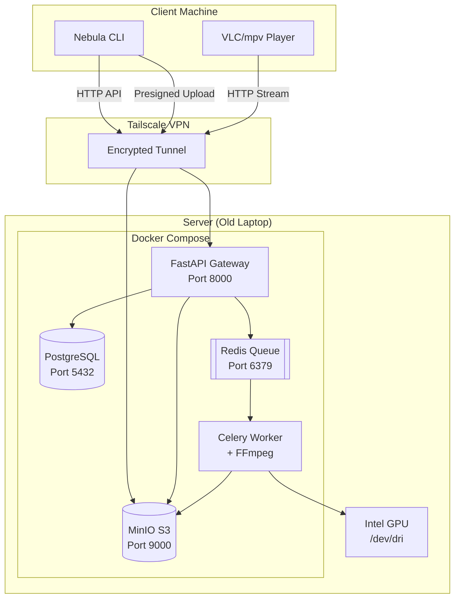
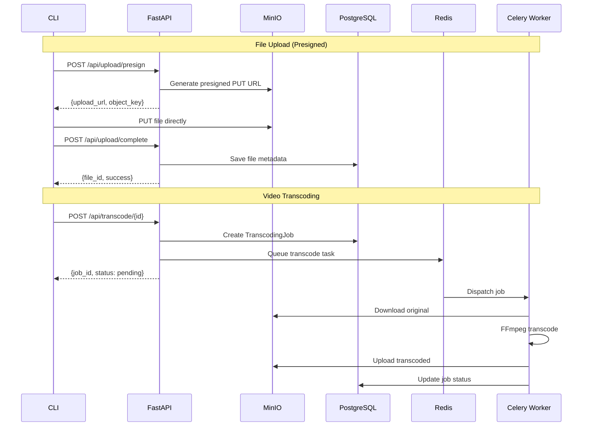

# 🌌 Nebula: Distributed Private Cloud & Streaming Engine

<div align="center">

**Your Personal Netflix + Dropbox on an Old Laptop**

[]()
[]()
[]()
[]()
[]()
[]()

</div>

---

## Table of Contents

- [Overview](#overview)
- [Tech Stack](#tech-stack)
- [Features](#features)
- [Project Structure](#project-structure)
- [Quick Start](#quick-start)
- [Architecture](#architecture)
- [CLI Commands](#cli-commands)
- [API Reference](#api-reference)
- [Configuration](#configuration)
- [Database Schema](#database-schema)
- [Development](#development)
- [Troubleshooting](#troubleshooting)

---

## Overview

Nebula transforms a single "waste" laptop into a private cloud platform for storing and streaming media files. It provides S3-compatible object storage, HTTP byte-range video streaming, background video transcoding, and secure access via Tailscale VPN.

### Core Capabilities

| Capability | Description |
|------------|-------------|
| **Object Storage** | S3-compatible storage (MinIO) for unlimited file types |
| **Video Streaming** | HTTP byte-range streaming (206 Partial Content) with seeking |
| **Multi-Quality Transcoding** | FFmpeg-powered 480p/720p/1080p conversion with GPU support |
| **Background Jobs** | Celery + Redis for async transcoding with progress tracking |
| **Presigned URLs** | Direct upload/download to MinIO (bypasses API for speed) |
| **Zero-Trust Security** | Tailscale VPN mesh network (no public ports exposed) |
| **Auto Network Detection** | CLI auto-detects local vs remote network for optimal routing |
| **Remote Management** | View logs, restart services, monitor containers via CLI |

---

## Tech Stack

### Backend
| Technology | Purpose |
|------------|---------|
| **FastAPI** | High-performance async REST API framework |
| **SQLAlchemy 2.0** | ORM with async support |
| **PostgreSQL 15** | Relational database for metadata |
| **Alembic** | Database migrations |
| **MinIO** | S3-compatible object storage |
| **Redis** | Message broker for Celery |
| **Celery** | Distributed task queue for transcoding |
| **FFmpeg** | Video transcoding engine |

### Client
| Technology | Purpose |
|------------|---------|
| **Typer** | CLI framework with auto-completion |
| **Rich** | Beautiful terminal formatting |
| **Requests/HTTPX** | HTTP client |

### Infrastructure
| Technology | Purpose |
|------------|---------|
| **Docker Compose** | Multi-container orchestration |
| **Tailscale** | Zero-trust VPN mesh |
| **Intel QSV** | Hardware-accelerated transcoding (optional) |

---

## Features

### File Operations
- **`nebula upload <file>`** – Upload files of any size with presigned URLs
- **`nebula list`** – List all files with metadata (size, type, upload date)
- **`nebula download <id>`** – Download files with progress bars
- **`nebula play <id>`** – Stream videos directly to VLC/mpv with seeking

### Video Transcoding
- **`nebula transcode <id>`** – Create 480p/720p/1080p versions in background
- **`nebula transcode-status <id>`** – Watch transcoding progress in real-time
- **`nebula transcode-jobs`** – List all transcoding jobs with status
- **`nebula transcode-cancel <job_id>`** – Cancel pending/running jobs
- **`nebula play <id> --quality 480`** – Stream transcoded variants

### System Management
- **`nebula ping`** – Server connectivity check
- **`nebula status`** – System health dashboard (CPU, memory, disk, battery)
- **`nebula logs [service]`** – View container logs remotely
- **`nebula restart [service]`** – Restart containers from CLI
- **`nebula containers`** – Show Docker container status

### Performance Testing
- **`nebula benchmark <file>`** – Full performance benchmark (upload, download, stream, transcode)

---

## Project Structure

```
nebula/
├── server/                      # Backend services
│   ├── docker-compose.yml       # Container orchestration
│   ├── .env                     # Server environment variables
│   └── backend/
│       ├── Dockerfile           # API container image
│       ├── requirements.txt     # Python dependencies
│       ├── alembic/             # Database migrations
│       │   └── versions/        # Migration scripts
│       └── app/
│           ├── main.py          # FastAPI entrypoint
│           ├── worker.py        # Celery worker & tasks
│           ├── api/             # REST API endpoints
│           │   ├── ping.py      # Health check
│           │   ├── upload.py    # File upload + presigned URLs
│           │   ├── files.py     # File CRUD operations
│           │   ├── stream.py    # Video streaming (byte-range)
│           │   ├── transcode.py # Transcoding jobs
│           │   └── system.py    # Logs, restart, status
│           ├── core/            # Core utilities
│           │   ├── config.py    # Settings from env
│           │   ├── database.py  # SQLAlchemy session
│           │   ├── s3_client.py # MinIO wrapper
│           │   └── security.py  # Auth utilities
│           ├── models/          # SQLAlchemy models
│           │   ├── file.py      # File metadata
│           │   ├── job.py       # Transcoding jobs
│           │   └── user.py      # User accounts (future)
│           └── services/        # Business logic
│               ├── file_service.py
│               ├── metadata_service.py
│               └── transcode_service.py
│
├── client/                      # CLI client
│   └── cli/
│       ├── pyproject.toml       # Package config
│       ├── .env.client          # Client environment
│       └── src/
│           ├── main.py          # Typer CLI app
│           └── commands/        # CLI commands
│               ├── upload.py
│               ├── download.py
│               ├── list.py
│               ├── play.py
│               ├── transcode.py
│               ├── status.py
│               ├── system.py
│               └── benchmark.py
│
├── benchmark.py                 # Performance testing script
├── STREAMING_GUIDE.md           # Video streaming documentation
└── GLOBAL_INSTALL_GUIDE.md      # System-wide CLI installation
```

---

## Quick Start

### Prerequisites

- Docker & Docker Compose
- Python 3.10+
- Tailscale (for remote access)
- VLC or mpv (for video playback)

### Server Setup

```bash
# Clone repository
git clone https://github.com/zeus-10/nebula.git ~/nebula
cd ~/nebula/server

# Create environment file
cat > .env << 'EOF'
# Security
SECRET_KEY=your-secret-key-here-change-in-production

# Database
POSTGRES_USER=nebula
POSTGRES_PASSWORD=nebula_secure
POSTGRES_DB=nebula_meta
DATABASE_URL=postgresql://nebula:nebula_secure@db:5432/nebula_meta

# MinIO S3 Storage
MINIO_ROOT_USER=admin
MINIO_ROOT_PASSWORD=nebula_secure
S3_ENDPOINT=http://s3:9000
S3_ACCESS_KEY=admin
S3_SECRET_KEY=nebula_secure
S3_BUCKET=nebula-uploads

# Presigned URLs (for direct S3 access)
S3_PRESIGN_ENDPOINT_LOCAL=http://192.168.1.100:9000
S3_PRESIGN_ENDPOINT_REMOTE=http://100.x.x.x:9000

# Redis
REDIS_URL=redis://queue:6379/0
EOF

# Start all services
docker-compose up -d

# Initialize database
docker exec -it nebula-api alembic upgrade head

# Verify services are running
docker ps
```

### Client Setup

```bash
cd ~/nebula/client/cli

# Create virtual environment
python3 -m venv ../.venv
source ../.venv/bin/activate

# Install CLI
pip install -e .

# Configure server connection
cat > .env.client << 'EOF'
# Option 1: Single server URL
NEBULA_SERVER_URL=http://YOUR_TAILSCALE_IP:8000

# Option 2: Auto-detect local vs remote (recommended)
NEBULA_LOCAL_URL=http://192.168.1.100:8000
NEBULA_REMOTE_URL=http://100.x.x.x:8000
EOF

# Test connection
nebula ping
```

---

## Architecture

### System Overview



### Data Flow



### Service Communication

| Service | Container | Port | Purpose |
|---------|-----------|------|---------|
| API Gateway | nebula-api | 8000 | REST API, streaming proxy |
| Object Storage | nebula-s3 | 9000, 9001 | MinIO S3 + Console |
| Database | nebula-db | 5432 | PostgreSQL metadata |
| Queue | nebula-queue | 6379 | Redis message broker |
| Worker | nebula-worker | - | Celery + FFmpeg transcoding |

---

## CLI Commands

### Quick Reference

```bash
# Connectivity
nebula ping                          # Check server connection

# File Operations  
nebula upload video.mp4              # Upload file
nebula upload video.mp4 --description "My movie"
nebula list                          # List all files
nebula list --limit 20 --skip 0      # Paginated list
nebula download 67                   # Download by ID
nebula download 67 -o ~/movie.mp4    # Custom output path

# Video Streaming
nebula play 67                       # Stream to VLC/mpv
nebula play 67 --player mpv          # Use specific player
nebula play 67 --quality 720         # Stream 720p version

# Transcoding
nebula transcode 67                  # Default: 480p, 720p
nebula transcode 67 -q 480,720,1080  # Custom qualities
nebula transcode-status 67           # Check progress
nebula transcode-status 67 --watch   # Live progress
nebula transcode-jobs                # List all jobs
nebula transcode-jobs --status failed
nebula transcode-cancel 123          # Cancel a job

# System Management
nebula status                        # Health dashboard
nebula logs                          # All container logs
nebula logs api -n 200               # API logs (200 lines)
nebula containers                    # Container status
nebula restart worker --force        # Restart worker

# Performance Testing
nebula benchmark video.mp4           # Full benchmark
nebula benchmark video.mp4 --skip-transcode
nebula benchmark video.mp4 -o results.json
```

### Command Details

| Command | Description | Options |
|---------|-------------|---------|
| `ping` | Test server connectivity | - |
| `upload <file>` | Upload file to cloud | `--description` |
| `list` | List uploaded files | `--limit`, `--skip` |
| `download <id>` | Download file by ID | `--output`, `-o` |
| `play <id>` | Stream video | `--player`, `--quality` |
| `transcode <id>` | Start transcoding | `--qualities`, `-q` |
| `transcode-status <id>` | Check transcode progress | `--watch`, `-w` |
| `transcode-jobs` | List all jobs | `--status`, `--limit` |
| `transcode-cancel <job_id>` | Cancel a job | - |
| `status` | System health | `--show-local`, `--show-server` |
| `logs [service]` | View logs | `--lines`, `-n` |
| `restart [service]` | Restart container | `--force`, `-f` |
| `containers` | Container status | - |
| `benchmark <file>` | Performance test | `--output`, `--skip-transcode`, `--verbose` |

---

## API Reference

### Health & Status

| Endpoint | Method | Description |
|----------|--------|-------------|
| `/` | GET | API info |
| `/health` | GET | Detailed health check (CPU, memory, disk, battery) |
| `/api/ping` | GET | Simple connectivity test |

### File Operations

| Endpoint | Method | Description |
|----------|--------|-------------|
| `/api/upload` | POST | Upload file (multipart) |
| `/api/upload/presign` | POST | Get presigned upload URL |
| `/api/upload/complete` | POST | Confirm presigned upload |
| `/api/files` | GET | List files (paginated) |
| `/api/files/{id}` | GET | Get file metadata |
| `/api/files/{id}` | DELETE | Delete file |

### Streaming & Download

| Endpoint | Method | Description |
|----------|--------|-------------|
| `/api/files/{id}/stream` | GET | Stream file (supports byte-range) |
| `/api/files/{id}/stream?quality=720` | GET | Stream transcoded version |
| `/api/files/{id}/download` | GET | Download file |
| `/api/files/{id}/download-url` | GET | Get presigned download URL |
| `/api/files/{id}/stream-url` | GET | Get presigned stream URL |

### Transcoding

| Endpoint | Method | Description |
|----------|--------|-------------|
| `/api/transcode/{file_id}` | POST | Start transcoding job |
| `/api/transcode/{file_id}` | GET | Get transcoding status |
| `/api/transcode/jobs` | GET | List all jobs |
| `/api/transcode/jobs/{job_id}` | GET | Get job details |
| `/api/transcode/jobs/{job_id}/cancel` | POST | Cancel job |

### System Management

| Endpoint | Method | Description |
|----------|--------|-------------|
| `/api/system/status` | GET | Container status |
| `/api/system/logs` | GET | All logs |
| `/api/system/logs/{service}` | GET | Service logs |
| `/api/system/restart` | POST | Restart all services |
| `/api/system/restart/{service}` | POST | Restart specific service |

---

## Configuration

### Server Environment Variables

```bash
# === Security ===
SECRET_KEY=your-secret-key-here

# === Database ===
POSTGRES_USER=nebula
POSTGRES_PASSWORD=nebula_secure
POSTGRES_DB=nebula_meta
DATABASE_URL=postgresql://nebula:nebula_secure@db:5432/nebula_meta

# === MinIO S3 Storage ===
MINIO_ROOT_USER=admin
MINIO_ROOT_PASSWORD=nebula_secure
S3_ENDPOINT=http://s3:9000
S3_ACCESS_KEY=admin
S3_SECRET_KEY=nebula_secure
S3_BUCKET=nebula-uploads

# === Presigned URLs ===
# For direct client ↔ MinIO transfers (bypasses API)
S3_PRESIGN_ENDPOINT_LOCAL=http://192.168.1.100:9000   # LAN IP
S3_PRESIGN_ENDPOINT_REMOTE=http://100.x.x.x:9000      # Tailscale IP
S3_PRESIGN_EXPIRES_SECONDS=900                         # 15 min default

# === Redis ===
REDIS_URL=redis://queue:6379/0

# === HTTP Connection Tuning ===
S3_HTTP_POOL_MAXSIZE=32
S3_HTTP_CONNECT_TIMEOUT=5
S3_HTTP_READ_TIMEOUT=60
```

### Client Environment Variables

```bash
# Option 1: Single server (always use this URL)
NEBULA_SERVER_URL=http://100.x.x.x:8000

# Option 2: Auto-detect network (recommended)
# CLI pings local first, falls back to remote
NEBULA_LOCAL_URL=http://192.168.1.100:8000
NEBULA_REMOTE_URL=http://100.x.x.x:8000
```

---

## Database Schema

### Files Table

| Column | Type | Description |
|--------|------|-------------|
| `id` | INTEGER | Primary key |
| `filename` | VARCHAR(255) | Original filename |
| `file_path` | VARCHAR(500) | S3 object key |
| `size` | BIGINT | File size in bytes |
| `mime_type` | VARCHAR(100) | MIME type |
| `file_hash` | VARCHAR(128) | SHA-256 hash (optional) |
| `video_metadata` | JSON | Duration, resolution, codec |
| `transcoded_variants` | JSON | `{"480": "path/480p.mp4", ...}` |
| `upload_date` | TIMESTAMP | Upload timestamp |
| `description` | TEXT | User description |
| `user_id` | INTEGER | Future: user reference |

### Transcoding Jobs Table

| Column | Type | Description |
|--------|------|-------------|
| `id` | INTEGER | Primary key |
| `file_id` | INTEGER | Foreign key to files |
| `target_quality` | INTEGER | 480, 720, or 1080 |
| `status` | VARCHAR(50) | pending/processing/completed/failed |
| `progress` | FLOAT | 0-100 percentage |
| `output_path` | VARCHAR(500) | S3 path of transcoded file |
| `output_size` | INTEGER | Transcoded file size |
| `error_message` | TEXT | Error details if failed |
| `ffmpeg_metadata` | JSON | Codec, bitrate, dimensions |
| `celery_task_id` | VARCHAR(255) | Celery task reference |
| `created_at` | TIMESTAMP | Job creation time |
| `started_at` | TIMESTAMP | Processing start time |
| `completed_at` | TIMESTAMP | Completion time |

---

## Development

### Running Locally

```bash
# Start services in development mode
cd server
docker-compose up -d

# Watch API logs
docker logs -f nebula-api

# Watch worker logs
docker logs -f nebula-worker

# Access MinIO console
open http://localhost:9001  # admin / nebula_secure

# Run database migrations
docker exec -it nebula-api alembic upgrade head

# Create new migration
docker exec -it nebula-api alembic revision --autogenerate -m "description"
```

### Running Tests

```bash
# Install test dependencies
pip install pytest pytest-asyncio httpx

# Run tests
pytest tests/ -v
```

### Code Style

```bash
# Format code
black server/backend/
isort server/backend/

# Type checking
mypy server/backend/
```

---

## Troubleshooting

### Uploads Hang Forever from WSL

**Cause:** WSL Tailscale conflicts with Windows Tailscale.

**Solution:**
```bash
sudo tailscale down
echo 'sudo tailscale down 2>/dev/null || true' >> ~/.bashrc
```

### "NEBULA_SERVER_URL environment variable not set"

**Solution:**
```bash
cd client/cli
echo "NEBULA_SERVER_URL=http://YOUR_TAILSCALE_IP:8000" > .env.client
```

### Video Seeking Doesn't Work

**Solution:** Verify byte-range support:
```bash
curl -I -H "Range: bytes=0-1000" http://YOUR_SERVER:8000/api/files/67/stream
# Should return: HTTP/1.1 206 Partial Content
```

### Transcoding Stuck at 0%

**Check worker logs:**
```bash
nebula logs worker -n 100
# Or
docker logs -f nebula-worker
```

**Verify FFmpeg is installed in worker:**
```bash
docker exec -it nebula-worker ffmpeg -version
```

### Cannot Connect from PowerShell

**Solution:** Add to PowerShell `$PROFILE`:
```powershell
function nebula {
    wsl -e bash -c "cd ~/nebula/client/cli && source ~/nebula/client/.venv/bin/activate && nebula $args"
}
```

### MinIO Console Not Accessible

**Check MinIO is running:**
```bash
docker ps | grep nebula-s3
# Access console at http://localhost:9001
# Login: admin / nebula_secure
```

### Database Connection Failed

**Reset database:**
```bash
docker-compose down -v  # WARNING: Deletes all data
docker-compose up -d
docker exec -it nebula-api alembic upgrade head
```

---

## License

MIT License - see [LICENSE](LICENSE) for details.

---

## Acknowledgments

Built with:
- [FastAPI](https://fastapi.tiangolo.com/) - Modern Python web framework
- [MinIO](https://min.io/) - S3-compatible object storage
- [Celery](https://celeryproject.org/) - Distributed task queue
- [FFmpeg](https://ffmpeg.org/) - Video transcoding
- [Typer](https://typer.tiangolo.com/) - CLI framework
- [Rich](https://rich.readthedocs.io/) - Terminal formatting
- [Tailscale](https://tailscale.com/) - Zero-trust VPN

---

<div align="center">

**[Report Bug](https://github.com/zeus-10/nebula/issues) · [Request Feature](https://github.com/zeus-10/nebula/issues)**

Made with ❤️ for the joy of building

</div>
